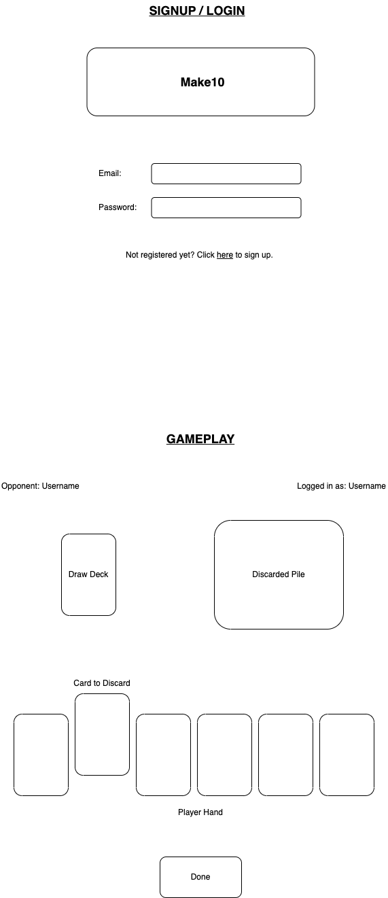
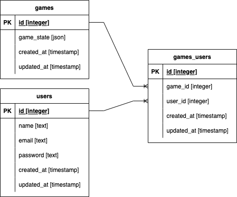

# make10

## Rules

- Players are handed 5 starting cards
- Players will form pairs of cards with values summing up to 10
- For picture (J, Q, K) or value 10 cards, player will need to get 2 of the same kind
- At each turn, the player can draw an additional card from the deck, or the last card that the opposing player discard.
- They will then discard a card. At any point, the player should only be holding 5 cards
- The winner is determined when one player draws a 6th card which forms the third pair in his hand

## Wire Frame

## ERD

## Milestones

### Base

- Sign up
- User authentication
- Two player

### Comfortable

- Multiplayer, up to 4 players
- Leaderboard

### More Comfortable

- Game lobby
