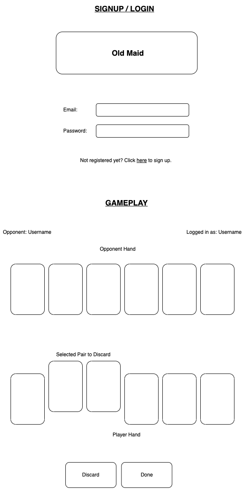
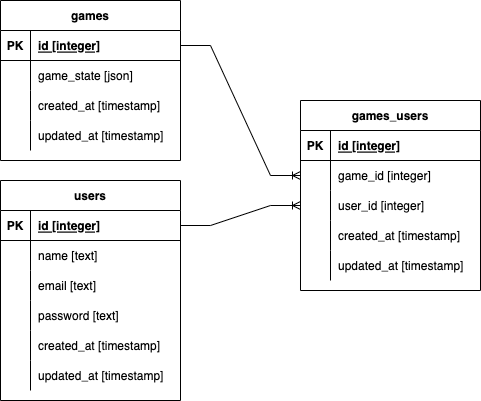

# Old Maid

## Cards Required

- The standard 52-card pack is used, however, one of the four queens is removed, leaving a total of 51 cards.

## Game Objective

- The goal is to form and discard pairs of cards, and not to be left with the odd card (a queen) at the end.

## The Deal

- Any player shuffles the pack and deals them around, one at a time to each player, until all the cards have been handed out.
- Players do not need to have an equal number of cards.

## Gameplay

- Each player removes all pairs from his hand face down.
- If a player has three-of-a-kind, they remove only two of those three cards.
- The dealer then offers their hand, spread out face down, to the player on the left, who draws one card from it.
- This player discards any pair that may have been formed by the drawn card.
- The player then offers their own hand to the player on their left.
- Play proceeds in this way until all cards have been paired except one - the odd queen, which cannot be paired - and the player who has that card is the Old Maid!

## Wire Frame

## ERD

## Milestones

### Base

- User log in page
- User authentication
- Single player with one AI opponent

### Comfortable

- Multiplayer, up to 4 players
- Leaderboard
